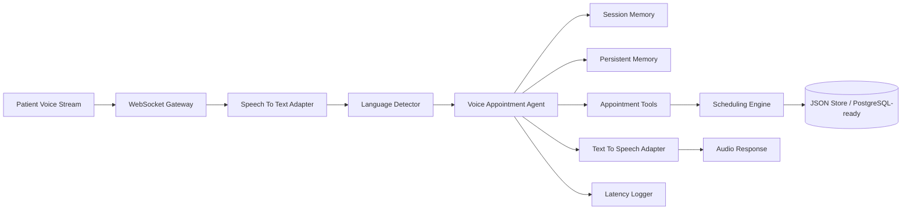

# Clinical Appointment Voice AI Architecture

## System Diagram

## Notes

- `backend/api/routes.py` exposes the health check, outbound campaign endpoint, and `/ws/voice` real-time socket.
- `agent/service.py` orchestrates STT, language detection, intent reasoning, tool execution, memory updates, TTS, and latency measurement.
- `memory/session_memory.py` uses Redis with an in-process fallback for conversation state and TTL-based session tracking.
- `memory/persistent_memory.py` stores patient preferences and interaction history in Redis and JSON files.
- `scheduler/appointment_engine.py` owns booking, rescheduling, cancellation, conflict detection, and alternative slot suggestions.
- `services/*` are provider adapters, so real STT/TTS engines can replace the mock implementations without changing agent logic.
